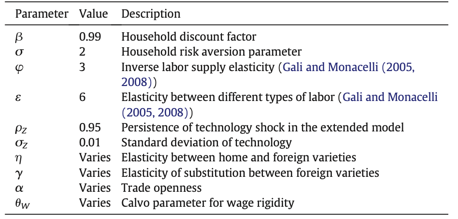
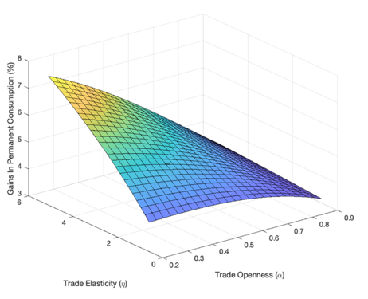
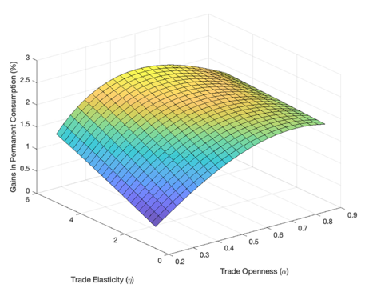
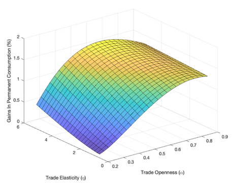
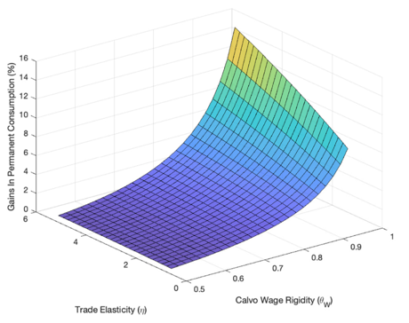

# MonetaryUnionsJIE2018
We derive the optimal fiscal transfer scheme for countries 
in a monetary union to offset the welfare losses resulting 
from asymmetric shocks and nominal rigidities. 
Optimal transfers involve a tradeoff between reducing 
national output gaps and the provision of consumption 
insurance across countries, where the weight of the former 
increases relative to the latter as consumption home bias 
rises. The welfare gains from optimal transfers increase in wage rigidity and trade elasticities and are particularly large when risk-sharing through financial markets breaks down. For the average euro area economy, the welfare gains from optimal transfers range from 0.50% of permanent consumption under complete markets and low wage rigidity to 6.09% of permanent consumption under financial autarky and high wage rigidity.
### Calibration of the Extended Model

### Fig. 1. Welfare Gains from Optimal Transfers in Financial Autarky. Calibration : θW= 0.87, γ = 3.75, ρZ = 0.95, σZ = 0.01.

### Fig. 2. Welfare Gains from Optimal Transfers in Incomplete Markets. Calibration : θW = 0.87, γ = 3.75, ρZ = 0.95, σZ = 0.01

### Fig. 3. Welfare Gains from Optimal Transfers in Complete Markets. Calibration : θW = 0.87, γ = 3.75, ρZ = 0.95, σZ = 0.01

### Fig. 4. Welfare Gains from Optimal Transfers in Financial Autarky. Calibration : α = 0.35, γ = 3.75, ρZ = 0.95, σZ = 0.01

# How to reproduce experiments:
This file reproduces figure 4, where welfare losses from the business cycle depend on
trade elasticity and calvo wage rigidity. In particular, higher wage rigidity 
and higher trade elasticity lead to an increase in welfare losses.
`matlab fiscal_union_figures4.m`